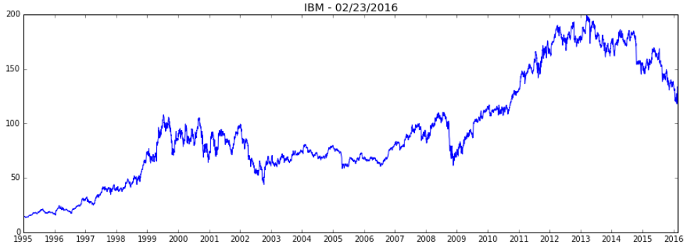
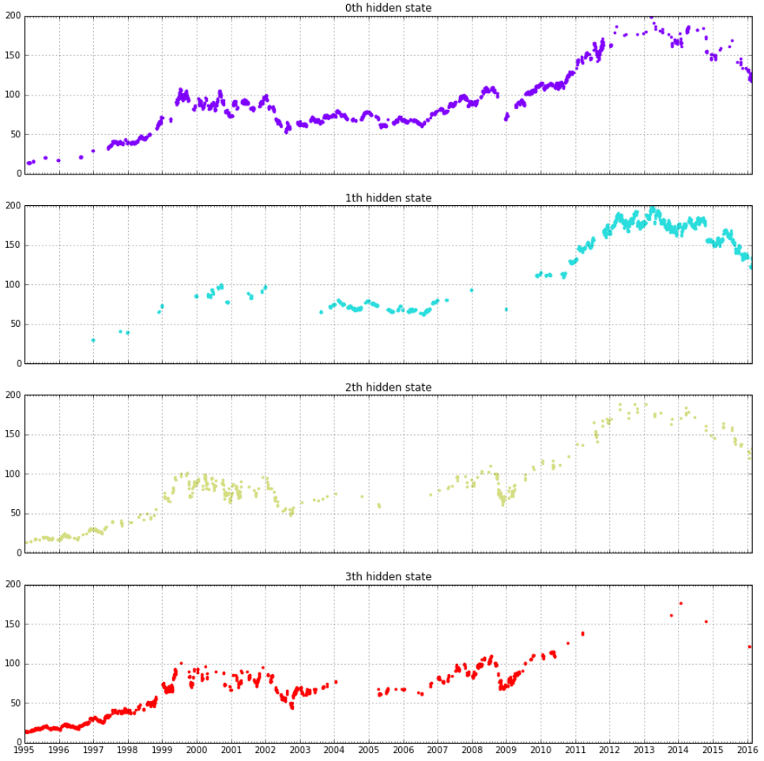
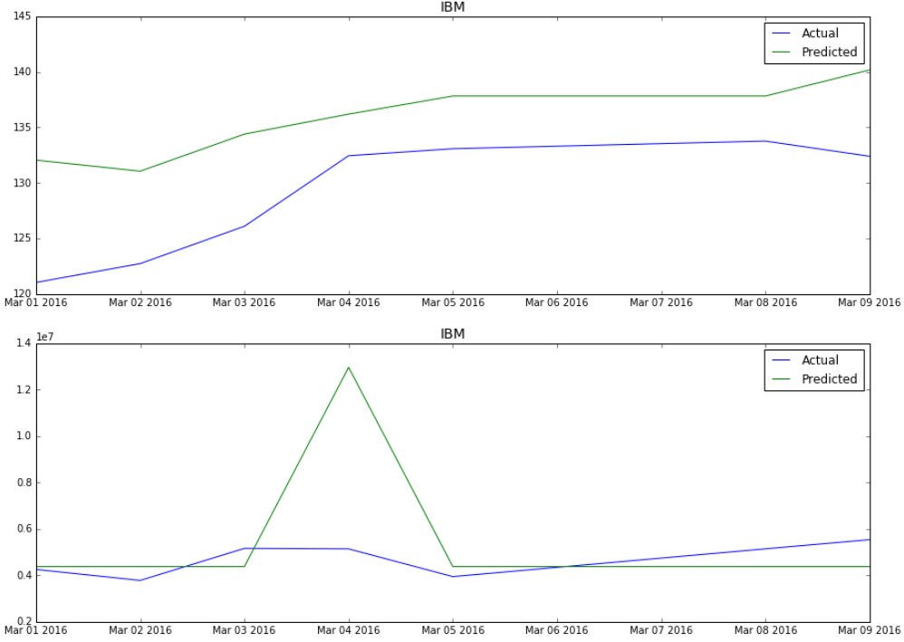

# StockPredict

- This project mainly implements stock prediction based on Hidden Markov Model using python (pandas, tushare, hmmlearn) and deployed to WeChat mini program. User can get stock history trends and predictions by querying stock code in our WeChat mini program.
- 本项目主要实现了基于隐马尔科夫模型的 Python 股票预测系统，并将其部署到了微信小程序。用户可以输入股票代码获得股票历史以及未来走势预测。

- Stock History

    

- Hidden State

    

- Results

    

- See full [report](Stockalize证券分析系统.pdf)

- Since yahoo has ceased to provide its historical quotes service, the quotes_historical_yahoo_ochl function stopped working. This project may not be run directly. 由于 yahoo 停止了 API 接口，本项目可能无法直接运行。
